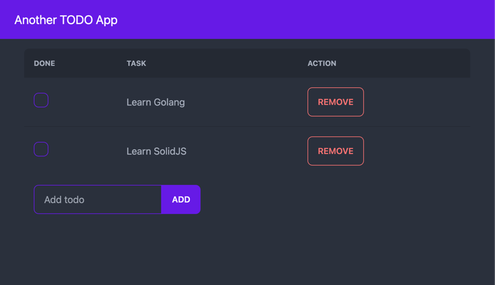

# Yet another TODO app

A todo application written in go which uses Go [embed](https://golang.org/pkg/embed/) package to embed a SolidJS UI into our Go binary.

## How to run

At the application root, run:
```bash

go generate ./..
```
then build and run the application:
```bash
go build -o todo
./todo
```
You should see the following:
<p>

</p>

This application is just an example of how to embed a SolidJS UI into a Go binary. It is not meant to be a production ready application.

### Helpful Resources
- [Go embed](https://golang.org/pkg/embed/)
- [SolidJS](https://www.solidjs.com/)
- [jacoelho - React golang embeddable](https://github.com/jacoelho/sample-go-react)
